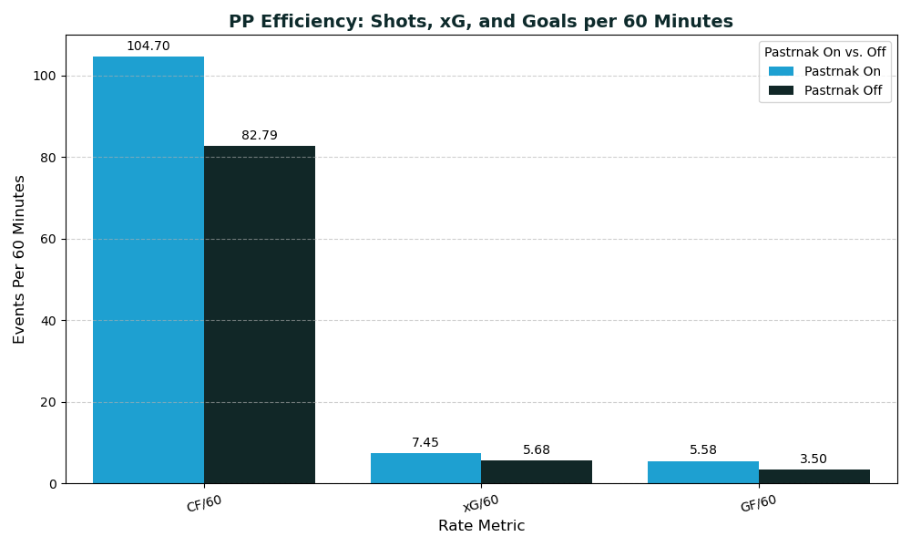
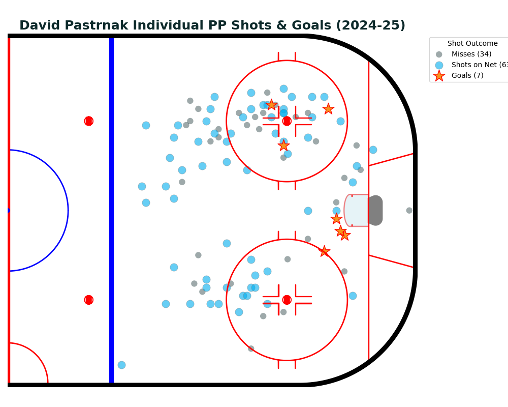

# 🏒 DAVID PASTRNAK: POWER PLAY EFFICIENCY ANALYSIS (2024-2025)

## 📌 Project Goal
This project establishes the true offensive efficiency (production per 60 minutes) of the Boston Bruins' primary 5-on-4 power play unit, led by David Pastrnak, through rigorous analysis of advanced metrics (xG, CF).

---
## 📊 CORE ANALYTICAL FINDINGS

The analysis compares the performance during **Pastrnak's Shifts (1st Unit)** against the performance during the **Rest of the Team's Power Play Time (2nd Unit Proxy)**.

| Metric | Pastrnak (1st Unit Time) | Rest of PP Time (2nd Unit Proxy) | Conclusion |
| :--- | :--- | :--- | :--- |
| **Corsi For / 60min (CF/60)** | **[104.70]** | **[82.79]** | **Higher Volume:** Pastrnak's unit generates higher shot volume per minute. |
| **Expected Goals / 60min (xG/60)** | **[7.45]** | **[5.68]** | **Higher Quality:** Higher probability of scoring per shot. |
| **Goals For / 60min (GF/60)** | **[5.58]** | **[3.50]** | **More Lethal:** Higher actual goal-scoring rate per minute. |

### Visual Proof of Process
The final shot map displays Pastrnak's **individual shot locations (Goals, Shots on Net, Misses)** on a standardized rink, visually confirming his footprint on the power play.

---
## 🧠 METHODOLOGY: A Case Study in Data Resourcefulness

This project demonstrates proficiency in **Python (Pandas/NumPy)** by documenting the necessary solutions required to overcome analytical flaws and data inconsistencies.

### 1. Project Pivot and Data Sourcing
We initially attempted the **NHL API** but quickly realized it lacked reliable **Time On Ice (TOI)** data for power play situations. This would have required building complex loops to calculate our own TOI, a task too prone to error for a foundational project.

**My Solution:** I pivoted the project to use reliable **MoneyPuck** data, which provided pre-aggregated TOI and xG metrics.

### 2. The Critical Contamination Fix
* **The Problem:** We could not simply average the other players' stats to get the **Rest of Team (OFF)** baseline, as their statistics were contaminated by time they spent on the ice with Pastrnak.
* **The Solution:** We used **three files**—Team $\text{PP TOI}$ (total), $\text{Pastrnak's ON TOI}$, and $\text{Pastrnak's OffIce\_F}$ stats—to mathematically calculate the **uncontaminated OFF TOI denominator**. This ensures the $\text{OFF}$ rate is a true, accurate baseline.

### 3. Feature Engineering and Transformation
* **Rate Standardization:** All metrics were converted using the essential $(\text{Events} / \text{Minutes}) \times 60$ formula.
* **Coordinate Mirroring:** Applied the complex $\mathbf{200ft}$ $\text{NHL}$ scale transformation logic to the raw $\text{x/y}$ coordinates, flipping all shots to a single offensive end for accurate visualization.
* **Proxy Flag:** The $\text{ON/OFF}$ flag was defined as $\text{Direct Shooter Only}$ ($\text{shooterPlayerId}$ check) to ensure the numerator was analytically consistent.

## 🚀 PROJECT LIMITATIONS AND GROWTH

### Scope & Limitations
* This analysis is limited to $\mathbf{5}\text{-on-}\mathbf{4}$ power play situations only.
* The data covers only the $\mathbf{2024}\text{-}\mathbf{2025}$ $\text{Regular}$ $\text{Season}$.
* The **Goal and Shot map** plots Pastrnak as the **shooter only**, due to the absence of reliable $\text{assist}$ data in the raw files.

### Opportunities for Project Growth
* **SQL Integration:** Load the data into a $\text{PostgreSQL}$ or $\text{BigQuery}$ environment to demonstrate advanced $\text{SQL}$ querying skills for aggregation.
* **Encompass Shift Data:** Utilize MoneyPucks shift data to integrate in depth analysis on who shared the ice with Pastrnak, how effective he was with specific pairings, and portray not only his shots, but all shots generated while he was on the ice, vs off the ice.

---
## 🔗 View the Analysis

For the full analytical report, visual interpretations, and conclusion, please visit my website:

[https://nextshiftanalytics.com]
